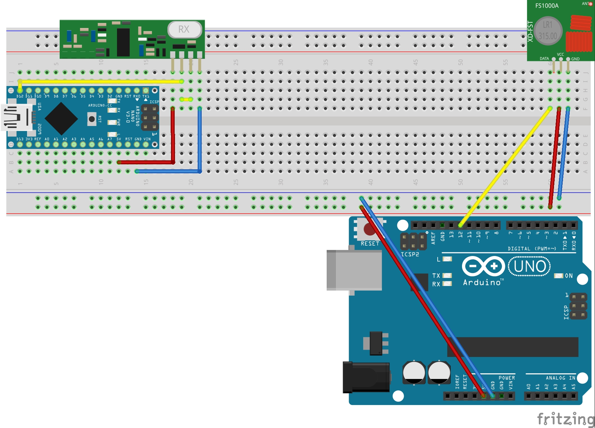

# wireless-serial-arduino

Attempt to use another arduino as serial output and learn using radio wireless modules.

[VirtualWire](http://www.airspayce.com/mikem/arduino/VirtualWire) library

Used transmitter FS100A + receiver 433 MHz XY-MK RF modules

## Sketch

Test configuration sketch:  

[Download sketch](./docs/sketch.fzz)
